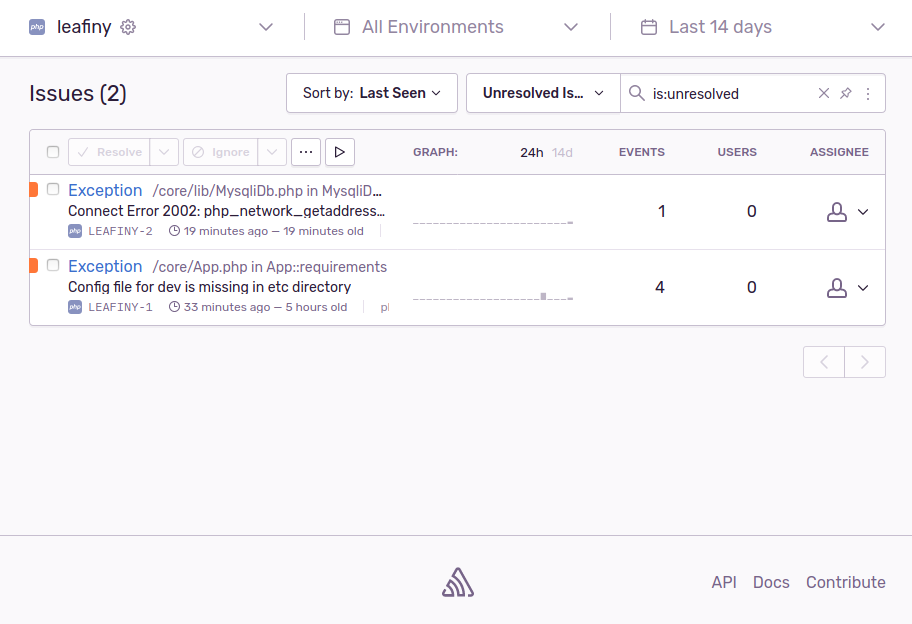

# Sentry_Log

The module integrates the **Sentry sdk** into Leafiny.



# Installation

Copy `Sentry_Log` into your Leafiny `modules` directory.

We need **composer** to add **sentry/sdk** library. Run the following command:

```
composer require sentry/sdk
```

# Dependency

**Sentry_Log** need the native **Leafiny_Log** module.

# Configuration

In global config file (ex: `etc/config.dev.php`), add **sentry_dsn** key in **app** configuration:

```php
$config = [
    'app' => [
        /* ... */
        'sentry_dsn' => 'https://x@y.ingest.sentry.io/z',
    ],
    /* ... */
];
```

Enter the DSN you got from **Sentry** for your project. You can find the DSN in the project settings under **Client Key (DSN)**